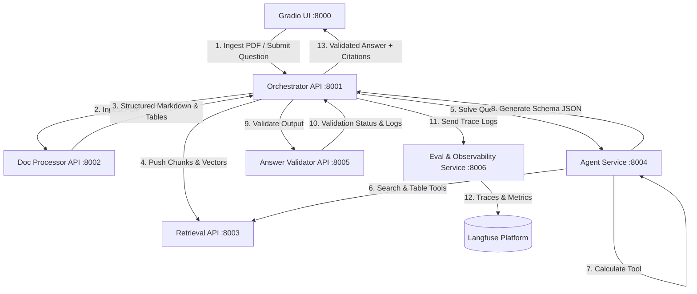
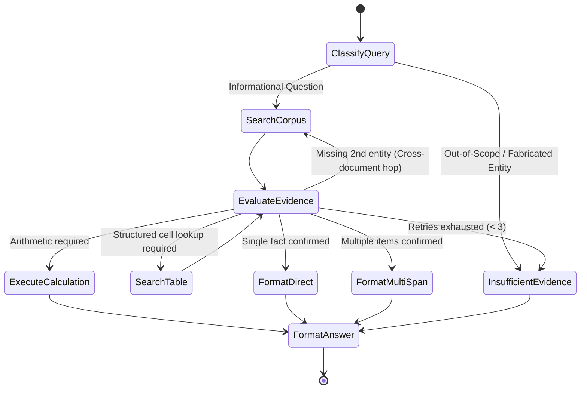

# 📘 PROJECT LEDGER: Complete Engineering Handbook & Architectural Blueprint
### *Financial Document Intelligence & Multi-Service RAG Agent System*
**Author / Team Guide:** MIA Robotics AI Team Training '27  
**System Name:** LEDGER (Large-scale Evidence Document Grounding & Evaluation RAG)  
**Target Repository:** `khilo619/M.I.A`

---

## 📑 TABLE OF CONTENTS
1. [Executive Summary & The Financial Intelligence Problem](#1-executive-summary--the-financial-intelligence-problem)
2. [What is RAG? Theoretical & Mathematical Foundations](#2-what-is-rag-theoretical--mathematical-foundations)
3. [Deep-Dive into Dataset & Repository Files](#3-deep-dive-into-dataset--repository-files)
4. [The 7 Microservices Architecture & Complete API Contracts](#4-the-7-microservices-architecture--complete-api-contracts)
5. [End-to-End Pipeline Phases: Techniques, Math & Trade-off Analysis](#5-end-to-end-pipeline-phases-techniques-math--trade-off-analysis)
6. [Demystifying the Tech Stack & The "Lang" Ecosystem](#6-demystifying-the-tech-stack--the-lang-ecosystem)
7. [Agentic Reasoning with LangGraph: Cyclic Graphs & Deterministic Tools](#7-agentic-reasoning-with-langgraph-cyclic-graphs--deterministic-tools)
8. [Strict Answer Schema & Answer Validator Engineering](#8-strict-answer-schema--answer-validator-engineering)
9. [Automated Evaluation, Metrics & Langfuse Observability](#9-automated-evaluation-metrics--langfuse-observability)
10. [Bonus Features: High-Value Engineering vs. Vanity Additions](#10-bonus-features-high-value-engineering-vs-vanity-additions)
11. [6-Member Team Work Division, Git Flow & PR Governance](#11-6-member-team-work-division-git-flow--pr-governance)
12. [Clean System Design & Production Repository Blueprint](#12-clean-system-design--production-repository-blueprint)
13. [Critical Financial & Production Edge-Cases](#13-critical-financial--production-edge-cases)

---

# 1. Executive Summary & The Financial Intelligence Problem

### 1.1 The Business Problem in Financial Intelligence
Financial documents (SEC 10-K/10-Q reports, annual statements, auditor balance sheets, earnings call transcripts) are the lifeblood of investment, auditing, and corporate credit operations. However, extracting intelligence from them presents steep engineering hurdles:
1. **Extreme Structural Heterogeneity**: Financial filings are not plain prose. They consist of complex multi-column layouts, merged headers, parenthetical accounting notes, footnote references, and multi-page consolidated statements.
2. **Zero-Tolerance for Hallucination**: Generating a wrong financial metric (e.g., stating Operating Income as $\$142.5\text{M}$ instead of $\$14.25\text{M}$, or confusing 2019 with 2020) can invalidate investment decisions and trigger regulatory or compliance failures.
3. **Discrete Reasoning & Scale Synchronization**: Financial questions frequently require multi-step arithmetic (e.g., calculating percentage growth, compound margins, or difference between competitors). Furthermore, numbers often appear in disparate scales (e.g., Company A reports in *"thousands"*, Company B in *"millions"*).
4. **Corpus-Wide Exploration**: Analysts do not know which exact report contains the answer. The system must search over thousands of corporate documents simultaneously without being prompted with the target file name.

### 1.2 Why Naive LLMs Fail Completely
If an organization feeds financial PDFs to an unaugmented Large Language Model (e.g., standard GPT-4, Llama-3, Qwen-2.5):
* **Context Saturation & "Lost in the Middle"**: Ingesting hundreds of pages into a context window degrades retrieval quality. Transformer attention heads prioritize tokens at the extreme beginning and end of long prompts, ignoring evidence buried in intermediate pages.
* **Arithmetic Incompetence**: LLMs are autoregressive token predictors based on statistical likelihoods. They **do not perform deterministic mathematical computation**. They will hallucinate multi-digit subtraction, division, and percentage operations.
* **Table Structure Destruction**: Passing raw text from PDFs strips cell coordinate boundaries. A standard LLM cannot reliably determine which column header belongs to which numerical row.
* **Ungrounded Fabrication**: Lacking provenance, an LLM invents plausible numbers and fake page citations to satisfy prompt constraints.

### 1.3 How LEDGER Solves It
**LEDGER** is an enterprise-grade, closed-loop, verifiable Document Understanding $\rightarrow$ Retrieval $\rightarrow$ Reasoning $\rightarrow$ Validation pipeline:
* **Deep Learning Layout OCR**: Converts binary PDFs into structured Markdown with explicit table coordinate grids and preserved hierarchy.
* **Multi-Stage Hybrid Search**: Combines Dense Vector embeddings (semantic nuance) and Sparse BM25 (exact ticker symbols, years, and values) fused via Reciprocal Rank Fusion (RRF).
* **Cross-Encoder Reranking**: Re-scores top candidates using deep cross-attention layers to eliminate false-positive distractors.
* **Cyclic Agentic Reasoning (LangGraph)**: Employs an agent that formulates multi-hop retrieval queries, evaluates evidence sufficiency, and delegates all calculations to a sandboxed Python calculator tool.
* **Strict Schema & Gatekeeper Validation**: Every generated answer must pass an independent `answer-validator-api` that validates citations, verifies formula operands, and checks data types before presenting results to the user.

---

# 2. What is RAG? Theoretical & Mathematical Foundations

Retrieval-Augmented Generation (RAG) is the paradigm of dynamically grounding an LLM's generative capacity on verified, external documents retrieved at inference time.

```
┌────────────────────────────────────────────────────────────────────────────────────────┐
│                              HIGH-LEVEL RAG ARCHITECTURE                               │
│                                                                                        │
│  [User Query] ──► [Hybrid Retrieval: BM25 + Dense] ──► [Cross-Encoder Reranker]        │
│                                                               │ (Top-5 Chunks)         │
│                                                               ▼                        │
│  [Validated Output] ◄── [Answer Validator] ◄── [LangGraph Agent + Python Calculator]   │
└────────────────────────────────────────────────────────────────────────────────────────┘
```

---

### 2.1 The Two Fundamental Lifecycles of RAG

#### A. Ingestion Pipeline (Offline Indexing)
1. **Document Loading**: Raw binary PDF files are acquired.
2. **Layout & OCR Decomposition**: Deep learning models parse text, bounding boxes, and table grids into structured Markdown.
3. **Table- & Layout-Aware Chunking**: Documents are split into semantic blocks while preserving table headers and injecting parent metadata.
4. **Vectorization (Embedding)**: Chunks are transformed into $d$-dimensional dense vectors.
5. **Dual Indexing**: Embeddings are stored in a Vector DB (Qdrant), while tokenized terms are indexed into an inverted index (BM25).

#### B. Query & Reasoning Pipeline (Online Inference)
1. **Query Processing**: User submits a natural language question across the corpus.
2. **First-Stage Retrieval**: Dense vector search retrieves semantic neighbors; BM25 retrieves exact keyword matches.
3. **Rank Fusion**: Reciprocal Rank Fusion (RRF) merges candidate lists into a unified Top-$K$ pool ($K \approx 30$).
4. **Second-Stage Reranking**: A Cross-Encoder computes full token-level cross-attention over $(q, c_i)$ pairs to yield the Top-$N$ pool ($N \approx 5$).
5. **Agentic Discrete Reasoning**: A LangGraph state machine orchestrates tool calls (`search_tables`, `calculate`), executes multi-hop hops if evidence is incomplete, and constructs a schema-compliant JSON response.
6. **Strict Schema Validation**: The payload is sent to `answer-validator-api`. If valid, it is logged and rendered in the UI; if ungrounded, it is returned as `insufficient_evidence`.

---

### 2.2 Mathematical Foundations

#### 1. Vector Geometry & Similarity Metrics
Given query embedding $\mathbf{e}_q \in \mathbb{R}^d$ and chunk embedding $\mathbf{e}_c \in \mathbb{R}^d$:

* **Cosine Similarity**:
  $$\text{Sim}_{\cos}(\mathbf{e}_q, \mathbf{e}_c) = \frac{\mathbf{e}_q \cdot \mathbf{e}_c}{\|\mathbf{e}_q\|_2 \|\mathbf{e}_c\|_2} = \frac{\sum_{i=1}^d e_{q,i} e_{c,i}}{\sqrt{\sum_{i=1}^d e_{q,i}^2} \sqrt{\sum_{i=1}^d e_{c,i}^2}}$$
  *Invariant to vector magnitude; focuses strictly on angular orientation.*

* **Inner Product (Dot Product)**:
  $$\langle \mathbf{e}_q, \mathbf{e}_c \rangle = \sum_{i=1}^d e_{q,i} e_{c,i}$$
  *Equivalent to Cosine Similarity when vectors are $L_2$-normalized ($\|\mathbf{e}\|_2 = 1$).*

* **Euclidean Distance ($L_2$ Distance)**:
  $$D_{L_2}(\mathbf{e}_q, \mathbf{e}_c) = \sqrt{\sum_{i=1}^d (e_{q,i} - e_{c,i})^2}$$
  *Relationship to Cosine Similarity for unit vectors:*
  $$D_{L_2}^2 = 2 - 2 \cdot \text{Sim}_{\cos}(\mathbf{e}_q, \mathbf{e}_c)$$

---

#### 2. Sparse Lexical Search: BM25 Formula Breakdown
Given query $Q = \{q_1, q_2, \dots, q_n\}$ and document chunk $D$:

$$\text{Score}_{\text{BM25}}(D, Q) = \sum_{i=1}^{n} \text{IDF}(q_i) \cdot \frac{f(q_i, D) \cdot (k_1 + 1)}{f(q_i, D) + k_1 \cdot \left(1 - b + b \cdot \frac{|D|}{\text{avgdl}}\right)}$$

* $f(q_i, D)$: Raw term frequency of word $q_i$ in chunk $D$.
* $|D|$ and $\text{avgdl}$: Chunk length in tokens and average corpus chunk length.
* $k_1 \in [1.2, 2.0]$: Term frequency saturation constant. Prevents a word mentioned 50 times from dominating the score over a word mentioned 5 times.
* $b \in [0.75]$: Document length penalty. Penalizes long, verbose chunks to prevent bias toward large documents.
* $\text{IDF}(q_i)$: Inverted Document Frequency:
  $$\text{IDF}(q_i) = \ln \left( \frac{N - n(q_i) + 0.5}{n(q_i) + 0.5} + 1 \right)$$
  where $N$ is total chunks, and $n(q_i)$ is chunk count containing $q_i$.

> **Why BM25 is Crucial in Finance**: Embeddings treat `"2019"` and `"2020"` or `"$9,447"` and `"$8,210"` as virtually identical semantic vectors. BM25 guarantees hard lexical matching for specific dates, metrics, and dollar amounts.

---

#### 3. Reciprocal Rank Fusion (RRF)
Combines disparate scoring distributions (Dense Cosine $\in [-1, 1]$ and BM25 $\in [0, \infty)$) purely based on ordinal ranks:

$$\text{RRF\_Score}(d \in \mathcal{D}) = \sum_{m \in \{\text{dense}, \text{sparse}\}} \frac{1}{k + \text{rank}_m(d)}$$
where $k=60$ (standard constant preventing low ranks from exerting excessive weight). If document $d$ does not appear in rank list $m$, its $\text{rank}_m(d) = \infty$.

---

#### 4. Bi-Encoder vs. Cross-Encoder Mechanics
* **Bi-Encoder (Dense Retriever)**:
  $$\mathbf{u} = \text{Encoder}(q), \quad \mathbf{v} = \text{Encoder}(c), \quad s = \mathbf{u} \cdot \mathbf{v}$$
  *Fast ($O(1)$ ANN vector search)*, but query and chunk tokens never interact during transformer encoding.
* **Cross-Encoder (Reranker)**:
  $$\mathbf{x} = \text{[CLS]} \circ q_1 \dots q_m \circ \text{[SEP]} \circ c_1 \dots c_p \circ \text{[EOS]}$$
  $$\mathbf{H} = \text{Transformer}(\mathbf{x}), \quad s = \sigma(\mathbf{W}^T \mathbf{h}_{\text{[CLS]}} + b)$$
  *Computationally expensive ($O(K \cdot L^2)$)*, but every query token attends to every document token across all $L$ layers via bidirectional self-attention:
  $$\text{Attention}(Q, K, V) = \text{softmax}\left(\frac{QK^T}{\sqrt{d_k}}\right)V$$

---

# 3. Deep-Dive into Dataset & Repository Files

The repository contains three foundational project files:

```
/home/khaled/MIA/Project/
├── Final_Project.md              <-- Official specs, architecture, schema, requirements
├── record_schema_guide_ar-1.md   <-- Exhaustive Arabic guide explaining benchmark structure
└── questions_setA_practice.json  <-- 500KB gold evaluation benchmark with diagnostic metadata
```

---

### 3.1 The Dataset: TAT-DQA
* **Volume**: 16,558 questions across 2,758 financial PDF documents (3,067 total pages).
* **Characteristics**: Excerpts from Fortune 500 annual reports (Form 10-K). Contains intricate financial tables, explanatory notes, and narrative disclosures.
* **Question Diversity**: Direct lookups, multi-span list lookups, counting, arithmetic derivations (percentage changes, differences, sums, ratios), and unanswerable questions.
* **The "No Pre-Parsed JSON" Cardinal Rule**:
  > **MANDATORY**: Production ingestion must process the raw PDFs using an OCR/layout model. Using TAT-DQA's pre-parsed JSONs as input to your application is considered a severe violation. Pre-parsed JSONs may only be used as evaluation ground-truth.

---

### 3.2 Anatomy of `questions_setA_practice.json` & Schema Guide

Every record in `questions_setA_practice.json` is a comprehensive evaluation record containing 4 main layers:

```
┌────────────────────────────────────────────────────────────────────────────────────────┐
│                              BENCHMARK RECORD STRUCTURE                                │
│                                                                                        │
│  Layer 1: Question Core                                                                │
│  ├── question_id: "A001"                                                               │
│  ├── question_text: "What was the difference in finished goods between CTS & Jabil?"  │
│  └── task_family: "derived_cross_document"                                             │
│                                                                                        │
│  Layer 2: Ground Truth & Derivation                                                    │
│  ├── ground_truth_answer: 304811                                                       │
│  ├── answer_type: "arithmetic" | "span" | "multi-span" | "count" | "unanswerable"      │
│  ├── scale: "thousand" | "million" | "percent"                                         │
│  └── derivation: "abs(9447 - 314258)"                                                  │
│                                                                                        │
│  Layer 3: Provenance & Gold Evidence                                                   │
│  └── gold_evidence: [                                                                  │
│        { "source_document": "cts-corporation_2019.pdf", "page": 1, "gold_facts": ["9,447"] },│
│        { "source_document": "jabil-circuit-inc_2019.pdf", "page": 1, "gold_facts": ["314,258"] }│
│      ]                                                                                 │
│                                                                                        │
│  Layer 4: Stress-Testing Diagnostics (Hard Negatives & Baselines)                      │
│  ├── hard_negative_doc_uids: Similar-looking excerpts from other companies             │
│  ├── same_company_distractors: Other tables within the same company report             │
│  └── baseline_retrieval: BM25 and Dense baseline ranks for gold evidence               │
└────────────────────────────────────────────────────────────────────────────────────────┘
```

#### The 4 Task Families Explained
1. `authentic_single_document`: Standard single-page question. Requires localizing one table or paragraph.
2. `derived_cross_document`: Multi-hop question requiring facts from two distinct corporate filings (e.g., CTS and Jabil). The agent must formulate separate queries and harmonize scales.
3. `derived_source_identification`: The question describes a unique financial signature but deliberately omits the company name. The system must identify the firm from corpus disclosures.
4. `verified_unanswerable`: The requested metric does not exist in the corpus. The system must output `insufficient_evidence` without hallucinating.

#### Difficulty & Retrieval Tiers
* **`retrieval_tier`**:
  * *Tier 1*: Direct lexical/semantic match.
  * *Tier 2*: High semantic paraphrase or multiple competitor distractors.
  * *Tier 3*: Multi-document hops, unanswerable queries, or strong hard negatives.
* **`difficulty_tier`**:
  * *Tier 1*: Direct fact extraction (`span`).
  * *Tier 2*: Multi-span extraction or item counting (`multi-span`, `count`).
  * *Tier 3*: Multi-step arithmetic derivations and unit conversions.

---

# 4. The 7 Microservices Architecture & Complete API Contracts

The project mandates a decoupled microservices architecture with 7 distinct HTTP services:



---

### Service 1: `doc-processor-api` (Port: 8002)
* **Framework**: FastAPI + Marker / Surya OCR / pdfplumber.
* **Role**: Ingests raw PDFs, extracts text layout, detects table grids, outputs structured markdown blocks with coordinate metadata.
* **Endpoint**: `POST /process_pdf`
  * **Input**: `multipart/form-data` with `file: UploadFile`, `document_id: str`
  * **Output**:
    ```json
    {
      "document_id": "cts-corporation_2019.pdf",
      "total_pages": 3,
      "blocks": [
        {
          "block_id": "blk_001",
          "page": 1,
          "content_type": "table",
          "section_header": "Note 4: Inventories",
          "markdown_content": "| Category | 2019 | 2018 |\n| --- | --- | --- |\n| Finished Goods | 9,447 | 8,210 |",
          "bbox": [54.0, 120.5, 500.0, 310.0]
        }
      ]
    }
    ```

---

### Service 2: `retrieval-api` (Port: 8003)
* **Framework**: FastAPI + Qdrant Vector DB + `rank_bm25` + `sentence-transformers`.
* **Role**: Indexes chunks, performs Hybrid Search (Dense + BM25 via RRF), and executes Cross-Encoder reranking.
* **Endpoint 1**: `POST /index_blocks`
  * **Input**: `{"document_id": "...", "blocks": [...]}`
  * **Output**: `{"status": "indexed", "indexed_chunks": 14}`
* **Endpoint 2**: `POST /search`
  * **Input**:
    ```json
    {
      "query": "Finished goods balance for CTS in 2019",
      "content_type": "table",
      "top_k_retrieval": 30,
      "top_k_rerank": 5
    }
    ```
  * **Output**:
    ```json
    {
      "results": [
        {
          "chunk_id": "chk_1082",
          "document_id": "cts-corporation_2019.pdf",
          "page": 1,
          "section": "Note 4: Inventories",
          "content_type": "table",
          "text": "| Category | 2019 | 2018 |\n| Finished Goods | 9,447 | 8,210 |",
          "score": 0.942,
          "retrieval_method": "hybrid_reranked"
        }
      ]
    }
    ```

---

### Service 3: `agent-service` (Port: 8004)
* **Framework**: FastAPI + LangGraph + Safe Calculator Engine.
* **Role**: Cyclic state-machine agent that orchestrates reasoning, executes tool calls, resolves multi-hop queries, and outputs schema-compliant JSON.
* **Endpoint**: `POST /solve_query`
  * **Input**: `{"query": "What is the difference between CTS and Jabil finished goods in 2019?"}`
  * **Output**:
    ```json
    {
      "raw_answer": {
        "answer_type": "calculated",
        "evidence": [
          {"document_id": "cts-corporation_2019.pdf", "page": 1, "section": "Inventories"},
          {"document_id": "jabil-circuit-inc_2019.pdf", "page": 1, "section": "Inventories"}
        ],
        "params": {
          "value": 304811.0,
          "formula": "abs(9447 - 314258)"
        }
      },
      "trace_metadata": {"iterations": 3, "tools": ["search_tables", "calculate"]}
    }
    ```

---

### Service 4: `answer-validator-api` (Port: 8005)
* **Framework**: FastAPI / Pydantic.
* **Role**: Impartial gatekeeper enforcing the Strict Answer Schema, logging console events, and blocking ungrounded output.
* **Endpoint**: `POST /validate_answer`
  * **Input**: JSON payload from `agent-service`.
  * **Output (Success)**:
    ```json
    {
      "is_valid": true,
      "error": null,
      "logged_message": "[ANSWER-VALIDATOR-SUCCESS] Received and validated answer of type 'calculated' with evidence [{'document_id': 'cts-corporation_2019.pdf', 'page': 1}, {'document_id': 'jabil-circuit-inc_2019.pdf', 'page': 1}]"
    }
    ```
  * **Output (Failure)**:
    ```json
    {
      "is_valid": false,
      "error": "Missing required evidence citation for operand in formula.",
      "logged_message": "[ANSWER-VALIDATOR-ERROR] Invalid answer for 'calculated': Evidence count mismatch."
    }
    ```

---

### Service 5: `eval-service` (Port: 8006)
* **Framework**: FastAPI + Langfuse SDK.
* **Role**: Executes batch benchmarks over `questions_setA_practice.json`, evaluates Exact Match, F1, and Numerical Accuracy, and records full execution traces.
* **Endpoint**: `POST /run_benchmark`
  * **Input**: `{"benchmark_file": "questions_setA_practice.json", "experiment_tag": "bge_reranker_v1"}`
  * **Output**: `{"status": "completed", "metrics": {"exact_match": 0.792, "f1": 0.854, "num_acc": 0.915, "mrr": 0.884}}`

---

### Service 6: `ui-service` (Port: 8000)
* **Framework**: Gradio.
* **Role**: User-facing dashboard providing:
  1. **Corpus Chat View**: Natural language questions, schema-formatted answers, and clickable evidence citations.
  2. **Corpus Dashboard**: Live count of indexed documents, extracted table explorer, query latency, and validator status logs.

---

### Service 7: `orchestrator-api` (Port: 8001)
* **Framework**: FastAPI.
* **Role**: Central API Gateway. Coordinates workflow routing among the other 6 microservices and handles system health checks.

---

# 5. End-to-End Pipeline Phases: Techniques, Math & Trade-off Analysis

### 5.1 Ingestion & PDF Parsing Techniques

| Method | Mechanics | Pros | Cons | Decision |
| :--- | :--- | :--- | :--- | :--- |
| **PyPDF / PDFMiner** | Extracts raw text character streams. | Extremely fast, zero GPU requirement. | Destroys table layouts; merges columns into unreadable text strings. | ❌ **Rejected** (Unusable for financial tables). |
| **Tesseract / EasyOCR** | Pixel OCR bounding box detection. | Reads scanned PDFs. | No semantic layout hierarchy; cannot reconstruct table grids. | ❌ **Rejected**. |
| **Deep Learning Layout OCR (Marker / Surya / LayoutLMv3)** | Vision Transformer + Layout Segmentation + Table Structure Recognition. | Reconstructs clean Markdown tables (`\| Col \|`), detects section headers, extracts bounding boxes. | Higher compute overhead. |  **SELECTED (Optimal for TAT-DQA)**. |

---

### 5.2 Chunking Strategies

| Technique | Description | Suitability for Finance | Decision |
| :--- | :--- | :--- | :--- |
| **Fixed Token Window (e.g. 500 chars)** | Arbitrarily splits text at token boundaries. |  **Catastrophic**: Slices tables in half, severing numbers from headers. | ❌ **Rejected**. |
| **Sentence Splitter (`\n\n`)** | Splits on paragraphs. | Moderate for narrative text, but mangles tabular rows. | ❌ **Rejected**. |
| **Table-Aware Markdown Chunking** | Treats each Markdown table as an atomic chunk; duplicates column headers if table exceeds max tokens; prepends document/section metadata. | **Exceptional**: Preserves all structural relationships and coordinates. |  **SELECTED (Mandatory)**. |
| **Parent-Child (Hierarchical) Chunking** | Indexes small child chunks (150 tokens) for precise vector matching; returns larger parent section (800 tokens) to the LLM. | **Exceptional**: High retrieval precision without losing surrounding narrative context. |  **SELECTED (For Narrative Text)**. |

---

### 5.3 Embedding Models Comparison

| Model | Dimensions | MTEB Rank | Context | Compute Req. | Decision |
| :--- | :--- | :--- | :--- | :--- | :--- |
| `all-MiniLM-L6-v2` | 384 | Mid | 256 | Ultra-low (CPU) | ❌ Lacks domain nuance for financial terminology. |
| `OpenAI text-embedding-3-small` | 1536 | High | 8191 | Cloud API | ❌ External API dependency. |
| **`BAAI/bge-large-en-v1.5`** | 1024 | Top Tier | 512 | Moderate (Local GPU/CPU) |  **SELECTED (Gold Standard Open Source)**. |
| **`BAAI/bge-m3`** | 1024 | Top Tier | 8192 | Moderate |  **Excellent Alternative (Multi-lingual/Hybrid)**. |

---

### 5.4 Vector Database Comparison

| Vector DB | Deployment | Payload Filtering | Native Hybrid Search | Decision |
| :--- | :--- | :--- | :--- | :--- |
| **FAISS** | In-memory C++ lib | Very weak (manual filtering) | No | ❌ Lacks metadata management. |
| **ChromaDB** | In-process SQLite | Moderate | Basic | ⚠️ Good for prototypes, slower under heavy load. |
| **Qdrant** | Standalone Rust Service | **Best in Class** (Fast payload filtering) | **Native Built-in** (Dense + Sparse) |  **SELECTED (Production Microservice)**. |

---

### 5.5 Reranker Selection

* **Selected Model**: `BAAI/bge-reranker-large` (or `FlashRank` for CPU deployment).
* **Funnel Architecture**:
  $$\text{Corpus (50,000 Chunks)} \xrightarrow[\text{Hybrid RRF Search}]{\text{Top 30}} \text{Candidates} \xrightarrow[\text{Cross-Encoder Reranking}]{\text{Top 5}} \text{Agent Context}$$

---

# 6. Demystifying the Tech Stack & The "Lang" Ecosystem

Beginners often confuse the libraries in the generative AI landscape. Here is the precise distinction:

```
┌────────────────────────────────────────────────────────────────────────────────────────┐
│                                 THE "LANG" ECOSYSTEM                                   │
│                                                                                        │
│  LangChain  ──► Generic framework for simple linear chains & prompt formatting.        │
│                                                                                        │
│  LangGraph  ──► Multi-agent state-machine framework for CYCLIC graphs, branching,     │
│                 dynamic tool calling, and state persistence.                           │
│                 (MANDATORY IN LEDGER FOR AGENT SERVICE).                               │
│                                                                                        │
│  Langfuse   ──► Open-source LLM Observability platform for tracing spans, token        │
│                 costs, latencies, and running automated benchmark experiments.         │
│                 (MANDATORY IN LEDGER FOR EVAL SERVICE).                                │
│                                                                                        │
│  LangSmith  ──► Proprietary SaaS observability tool from LangChain Corp.               │
│                 (Not used; replaced by open-source Langfuse).                          │
└────────────────────────────────────────────────────────────────────────────────────────┘
```

---

# 7. Agentic Reasoning with LangGraph: Cyclic Graphs & Deterministic Tools

### 7.1 State Machine Graph Architecture

A static linear chain (`Retrieve -> Generate`) fails on financial benchmarks because complex queries require multi-step lookups and conditional branching:



---

### 7.2 Deterministic Tools Implementation

LLMs must never perform mental math. LEDGER provides 4 sandboxed Python tools:

```python
# agent_service/tools.py
import simpleeval  # Safe mathematical evaluation without unsafe eval()


def search_documents(query: str, top_k: int = 5) -> list[dict]:
    """Searches corpus using hybrid dense + sparse retrieval."""
    # Calls retrieval-api /search
    ...


def search_tables(query: str, document_id: str | None = None) -> list[dict]:
    """Retrieves structured table grids and cell coordinates."""
    # Calls retrieval-api with content_type="table"
    ...


def calculate(expression: str) -> float:
    """
    Deterministically evaluates arithmetic expressions.
    Supports +, -, *, /, abs, round, min, max, pow.
    Guarantees zero LLM arithmetic hallucination.
    """
    safe_functions = {"abs": abs, "round": round, "min": min, "max": max, "pow": pow}
    try:
        return float(simpleeval.simple_eval(expression, functions=safe_functions))
    except Exception as e:
        raise ValueError(
            f"Arithmetic syntax error in expression '{expression}': {str(e)}"
        )


def filter_documents(company: str | None = None, year: int | None = None) -> list[str]:
    """Returns candidate document IDs matching metadata filters."""
    ...
```

---

# 8. Strict Answer Schema & Answer Validator Engineering

The `answer-validator-api` serves as an unbypassable gatekeeper. Output answers must strictly match one of the 4 defined schemas:

```
┌────────────────────────────────────────────────────────────────────────────────────────┐
│                              STRICT ANSWER SCHEMA BASE                                 │
│                                                                                        │
│  {                                                                                     │
│    "answer_type": "direct" | "calculated" | "multi_span" | "insufficient_evidence",    │
│    "evidence": [                                                                       │
│      { "document_id": "doc_01.pdf", "page": 1, "section": "Note 4: Inventories" }      │
│    ],                                                                                  │
│    "params": { ... }                                                                   │
│  }                                                                                     │
└────────────────────────────────────────────────────────────────────────────────────────┘
```

---

### The 4 Required Types

#### 1. Type: `direct`
* **Use Case**: Single factual lookup (e.g., Operating income in 2020).
* **Constraints**: `params.value` (string or number), `evidence` (at least 1 valid citation).
```json
{
  "answer_type": "direct",
  "evidence": [
    { "document_id": "cts-corporation_2019.pdf", "page": 1, "section": "Note 4: Inventories" }
  ],
  "params": {
    "value": "$9,447 thousand"
  }
}
```

#### 2. Type: `calculated`
* **Use Case**: Numerical values derived via arithmetic (differences, percentage changes, ratios).
* **Constraints**: `params.value` (number), `params.formula` (string representation of calculation), `evidence` (one citation per operand).
```json
{
  "answer_type": "calculated",
  "evidence": [
    { "document_id": "cts-corporation_2019.pdf", "page": 1, "section": "Inventories" },
    { "document_id": "jabil-circuit-inc_2019.pdf", "page": 1, "section": "Inventories" }
  ],
  "params": {
    "value": 304811.0,
    "formula": "abs(9447 - 314258)"
  }
}
```

#### 3. Type: `multi_span`
* **Use Case**: Lists of entities, expense categories, or multiple values.
* **Constraints**: `params.values` (array of strings/numbers), `evidence` (at least one citation per distinct value).
```json
{
  "answer_type": "multi_span",
  "evidence": [
    { "document_id": "amcon_2019.pdf", "page": 2, "section": "Operating Expenses" }
  ],
  "params": {
    "values": ["Salaries and wages", "Rent and utilities", "Depreciation"]
  }
}
```

#### 4. Type: `insufficient_evidence`
* **Use Case**: Information missing, question out of scope, or unanswerable.
* **Constraints**: `params.reason` (string explanation), `evidence` (empty array allowed).
```json
{
  "answer_type": "insufficient_evidence",
  "evidence": [],
  "params": {
    "reason": "No document in the indexed corpus reports restructuring charges for 2019."
  }
}
```

---

### Validator Implementation & Logging Specification

```python
# answer_validator/validator.py
from pydantic import BaseModel, Field, root_validator
from typing import Literal, List, Union, Dict, Any
import logging

logger = logging.getLogger("AnswerValidator")


class Citation(BaseModel):
    document_id: str
    page: int
    section: str = ""


class DirectParams(BaseModel):
    value: Union[str, float, int]


class CalculatedParams(BaseModel):
    value: float
    formula: str


class MultiSpanParams(BaseModel):
    values: List[Union[str, float, int]]


class InsufficientParams(BaseModel):
    reason: str


class StrictAnswer(BaseModel):
    answer_type: Literal["direct", "calculated", "multi_span", "insufficient_evidence"]
    evidence: List[Citation]
    params: Dict[str, Any]

    @root_validator
    def validate_schema_rules(cls, values):
        a_type = values.get("answer_type")
        evidence = values.get("evidence", [])
        params = values.get("params", {})

        if a_type == "direct":
            DirectParams(**params)
            if len(evidence) < 1:
                raise ValueError("Direct answer requires at least 1 evidence citation.")
        elif a_type == "calculated":
            calc = CalculatedParams(**params)
            if len(evidence) < 1:
                raise ValueError(
                    "Calculated answer requires evidence citations for operands."
                )
        elif a_type == "multi_span":
            ms = MultiSpanParams(**params)
            if len(ms.values) < 2:
                raise ValueError("Multi-span answer must contain at least 2 values.")
        elif a_type == "insufficient_evidence":
            InsufficientParams(**params)

        return values
```

* **Console Logging Rules**:
  * **Success**: `[ANSWER-VALIDATOR-SUCCESS] Received and validated answer of type 'calculated' with evidence [{'document_id': 'doc_041', 'page': 2}]`
  * **Failure**: `[ANSWER-VALIDATOR-ERROR] Invalid answer for 'calculated': Missing required key 'formula'.`

---

# 9. Automated Evaluation, Metrics & Langfuse Observability

### 9.1 Evaluation Metrics Formulas

1. **Exact Match (EM)**:
   $$\text{EM} = \frac{1}{N} \sum_{i=1}^N \mathbb{I}(\text{normalize}(\hat{y}_i) == \text{normalize}(y_i))$$
   *Binary metric ($1$ if prediction perfectly matches ground truth string, $0$ otherwise).*

2. **F1-Score (Token-Level Overlap)**:
   $$\text{Precision} = \frac{|T_{\hat{y}} \cap T_y|}{|T_{\hat{y}}|}, \quad \text{Recall} = \frac{|T_{\hat{y}} \cap T_y|}{|T_y|}$$
   $$\text{F1} = \frac{2 \cdot \text{Precision} \cdot \text{Recall}}{\text{Precision} + \text{Recall}}$$

3. **Numerical Accuracy (with Relative Tolerance $\epsilon = 0.01$)**:
   $$\text{Acc}_{\text{num}} = \mathbb{I}\left(\frac{|\hat{v} - v^*|}{\max(|v^*|, 10^{-5})} \le \epsilon\right)$$

4. **Retrieval Metrics (Recall@K & MRR)**:
   $$\text{Recall@K} = \frac{|\text{Retrieved@K} \cap \text{Gold Documents}|}{|\text{Gold Documents}|}$$
   $$\text{MRR} = \frac{1}{|Q|} \sum_{i=1}^{|Q|} \frac{1}{\text{rank}_i}$$
   where $\text{rank}_i$ is the position of the first relevant gold document.

---

### 9.2 Langfuse Tracing & 5-Example Failure Analysis

Langfuse wraps every span of the execution pipeline:
* **Trace Root**: User Query (`A001`)
  * **Span 1**: Hybrid Retrieval (Qdrant latency, BM25 score, candidates)
  * **Span 2**: Cross-Encoder Reranking (Scores per candidate)
  * **Span 3**: LangGraph Step 1 (Tool Call: `search_tables`)
  * **Span 4**: LangGraph Step 2 (Tool Call: `calculate`)
  * **Span 5**: Validator Execution (Pydantic validation pass/fail)

```
┌────────────────────────────────────────────────────────────────────────────────────────┐
│                        REQUIRED 5-EXAMPLE FAILURE ANALYSIS TEMPLATE                    │
│                                                                                        │
│ Example 1: Question A042                                                               │
│ ├── Expected: $14.3M | Predicted: $142.5M                                              │
│ ├── Root Cause Stage: Doc-Processor (Layout OCR)                                       │
│ ├── Diagnosis: Decimal point dropped in table cell parser during OCR bounding box merge│
│ └── Remediation: Updated table cell regex parser to preserve punctuation.             │
│                                                                                        │
│ Example 2: Question A108                                                               │
│ ├── Expected: 304,811 | Predicted: insufficient_evidence                               │
│ ├── Root Cause Stage: Retrieval (Cross-Document Hop)                                   │
│ ├── Diagnosis: Bi-Encoder failed to retrieve 2nd company due to aggressive distractor  │
│ └── Remediation: Configured LangGraph agent to execute explicit sub-query for 2nd firm │
└────────────────────────────────────────────────────────────────────────────────────────┘
```

---

# 10. Bonus Features: High-Value Engineering vs. Vanity Additions

| Bonus Feature | Architectural Value | Real Problem it Solves | Recommendation |
| :--- | :--- | :--- | :--- |
| **Full Docker Compose Orchestration** | **Critical** | Solves inter-service networking, environment parity, and one-command system startup. |  **MUST IMPLEMENT**. |
| **Bounding-Box PDF Highlighting in UI** | **High** | Gives the analyst visual auditability by drawing yellow bounding boxes directly on the source PDF page in Gradio. |  **MUST IMPLEMENT**. |
| **Query Decomposition (Multi-Query)** | **High** | Directly solves `derived_cross_document` task family by breaking compound questions into two sub-queries. |  **MUST IMPLEMENT**. |
| **Contextual Retrieval (Anthropic Style)** | **Medium-High** | Prepends document-level context to chunks before vectorization, eliminating pronoun ambiguity. | ⚠️ **Implement if time permits**. |
| **Semantic Caching** | **Low-Medium** | Saves cost on identical repeated queries, but benchmark questions are diverse. | ❌ **Skip (Low ROI for grading)**. |
| **SQL Database Alongside Vector Search** | **Low-Medium** | Creates redundant schema overhead since Marker already structures tables into Markdown. | ❌ **Skip**. |

---

# 11. 6-Member Team Work Division, Git Flow & PR Governance

To maximize velocity without merge conflicts, the team of 6 is structured along microservice boundaries, algorithm design, and full-stack DevOps responsibilities:

```
┌─────────────────────────────────────────────────────────────────────────────────────────────────┐
│                                   6-MEMBER TEAM DIVISION OF WORK                                │
│                                                                                                 │
│  Member 1 ──► Data Ingestion & OCR Lead (doc-processor-api + Table Structure + Chunker)         │
│  Member 2 ──► Search & Vector DB Lead (retrieval-api + Qdrant + BM25 + RRF + Cross-Encoder)     │
│  Member 3 ──► Reasoning Brain & Agent Lead (agent-service + LangGraph + Multi-hop Graph)        │
│  Member 4 ──► Schema, Validator & Tools Lead (answer-validator-api + Safe Calculator Engine)     │
│  Member 5 ──► Evaluation & MLOps Lead (eval-service + Langfuse Tracing + Automated Benchmarks)  │
│  Member 6 ──► Full-Stack UI & Infrastructure Lead (ui-service + Gradio Dashboard + Orchestrator)│
└─────────────────────────────────────────────────────────────────────────────────────────────────┘
```

---

### 11.1 Detailed Member Responsibilities Matrix

| Member | Primary Microservice & Role | Core Deliverables | Secondary & Cross-Cutting Support |
| :--- | :--- | :--- | :--- |
| **Member 1 (Data & OCR Lead)** | `doc-processor-api` | Deep learning OCR engine (Marker / Surya), table structure detection, bounding box coordinates extraction, table-aware and parent-child markdown chunker. | Coordinate mapping for PDF UI highlighting. |
| **Member 2 (Search & Retrieval Lead)** | `retrieval-api` | Qdrant vector database collection management, `rank_bm25` in-memory engine, BGE embeddings, RRF rank fusion, and Cross-Encoder (`bge-reranker-large`) reranking. | Ingestion indexing scripts and metadata filtering. |
| **Member 3 (Reasoning Brain Lead)** | `agent-service` | LangGraph cyclic state-machine, system prompt engineering, query classification, sub-query decomposition for multi-hop cross-doc questions, and candidate schema JSON synthesis. | Failure analysis diagnosis on agent logic. |
| **Member 4 (Schema, Validator & Tools Lead)** | `answer-validator-api` + Deterministic Tools | Pydantic strict answer schema enforcement, operand-evidence citation verification, console logging (`[ANSWER-VALIDATOR-SUCCESS]`), sandboxed `calculate` tool (`simpleeval`), and `filter_documents` tool. | Arithmetic precision and scale harmonization. |
| **Member 5 (Evaluation & MLOps Lead)** | `eval-service` | Langfuse self-hosted setup, automated benchmark test harness on `questions_setA_practice.json`, quantitative metrics computation (Exact Match, F1, Numerical Accuracy, MRR), and the 5-example failure analysis report. | Experimentation parameter tracking. |
| **Member 6 (Full-Stack UI & DevOps Lead)** | `ui-service` + `orchestrator-api` | Gradio interface (Corpus Chat view + System Dashboard), interactive PDF viewer with bounding-box evidence overlays, central API gateway (`orchestrator-api`), Docker Compose multi-service networking, and Makefile automation. | System startup and process monitoring. |

---

### 11.2 Git Branching Strategy & Workflow Example

The repository adopts a strict **Protected Main + Feature Branching** strategy.

```
main (Protected: Requires 1 Peer Approval + Passing Tests)
  │
  ├──► feature/doc-processor-ocr      (Member 1)
  ├──► feature/retrieval-hybrid-rerank(Member 2)
  ├──► feature/langgraph-reasoning    (Member 3)
  ├──► feature/validator-calculator   (Member 4)
  ├──► feature/eval-langfuse-suite    (Member 5)
  └──► feature/ui-dashboard-compose   (Member 6)
```

#### Demonstrative Step-by-Step CLI Walkthrough
Let us trace Member 2 implementing Hybrid Retrieval:

```bash
# 1. Update local main and create a feature branch
git checkout main
git pull origin main
git checkout -b feature/retrieval-service-hybrid

# 2. Implement Qdrant + BM25 hybrid search in retrieval-api
# ... (writing code in services/retrieval_api/) ...

# 3. Commit with semantic, clear messages
git add services/retrieval_api/
git commit -m "feat(retrieval): implement Qdrant dense search and BM25 RRF fusion"

# 4. Push branch to remote GitHub repository
git push -u origin feature/retrieval-service-hybrid

# 5. Open Pull Request (PR) on GitHub targeting `main`
```

---

### 11.3 PR Review & Governance Protocol

1. **The Rule of Two**: Every PR must receive at least **one peer review approval** from the designated paired member before merging into `main`.
2. **Reviewer Mapping Matrix**:
   * PR on `doc-processor-api` (Member 1) $\rightarrow$ Reviewed by **Member 2** (Retrieval Lead) or **Member 6** (UI Lead).
   * PR on `retrieval-api` (Member 2) $\rightarrow$ Reviewed by **Member 3** (Agent Lead).
   * PR on `agent-service` (Member 3) $\rightarrow$ Reviewed by **Member 4** (Validator Lead).
   * PR on `answer-validator-api` / Tools (Member 4) $\rightarrow$ Reviewed by **Member 5** (Eval Lead).
   * PR on `eval-service` (Member 5) $\rightarrow$ Reviewed by **Member 3** (Agent Lead).
   * PR on `ui-service` / `orchestrator-api` / Docker (Member 6) $\rightarrow$ Reviewed by **Member 1** (Data Lead) or **Member 4** (Validator Lead).
3. **PR Description Standard**: Every PR must state:
   * *Summary of Changes*
   * *Microservices Affected*
   * *Manual / Automated Test Verification Evidence (Console output, curl test, or Langfuse trace)*

---

# 12. Clean System Design & Production Repository Blueprint

```
/home/khaled/MIA/Project/
├── docker-compose.yml              # Single command multi-container launcher
├── Makefile                        # Dev commands: make up, make test, make eval
├── README.md                       # Complete setup, architecture & reproduction guide
├── LEDGER_HANDBOOK.md              # This engineering handbook
├── record_schema_guide_ar-1.md     # Arabic benchmark schema documentation
├── questions_setA_practice.json    # Gold evaluation benchmark
├── .env.example                    # Template for environment keys (Langfuse, etc.)
│
├── services/
│   ├── orchestrator_api/           # [Port 8001] Central API Gateway
│   │   ├── Dockerfile
│   │   ├── requirements.txt
│   │   └── src/
│   │       ├── main.py
│   │       ├── router.py
│   │       └── clients.py          # HTTP clients for downstream microservices
│   │
│   ├── doc_processor_api/          # [Port 8002] Layout OCR & Table Parsing
│   │   ├── Dockerfile
│   │   ├── requirements.txt
│   │   └── src/
│   │       ├── main.py
│   │       ├── parser.py           # Deep learning OCR (Marker / Surya wrapper)
│   │       ├── table_extractor.py  # Markdown table grid reconstructor
│   │       └── chunker.py          # Table-aware and parent-child chunker
│   │
│   ├── retrieval_api/              # [Port 8003] Hybrid Search & Reranking
│   │   ├── Dockerfile
│   │   ├── requirements.txt
│   │   └── src/
│   │       ├── main.py
│   │       ├── qdrant_store.py     # Qdrant client & vector collections
│   │       ├── bm25_engine.py      # In-memory sparse BM25 indexer
│   │       ├── rrf_fusion.py       # Reciprocal Rank Fusion implementation
│   │       └── reranker.py         # Cross-Encoder (bge-reranker-large)
│   │
│   ├── agent_service/              # [Port 8004] LangGraph Reasoning Brain
│   │   ├── Dockerfile
│   │   ├── requirements.txt
│   │   └── src/
│   │       ├── main.py
│   │       ├── graph.py            # LangGraph StateGraph & conditional edges
│   │       ├── state.py            # TypedDict state definitions
│   │       ├── tools.py            # Sandboxed calculate, search_tables, search_docs
│   │       └── prompts.py          # System prompts for discrete financial reasoning
│   │
│   ├── answer_validator_api/       # [Port 8005] Strict Schema Gatekeeper
│   │   ├── Dockerfile
│   │   ├── requirements.txt
│   │   └── src/
│   │       ├── main.py
│   │       ├── schemas.py          # Pydantic StrictAnswer models
│   │       └── validator.py        # Logic & structured console logging
│   │
│   ├── eval_service/               # [Port 8006] Benchmark Harness & Observability
│   │   ├── Dockerfile
│   │   ├── requirements.txt
│   │   └── src/
│   │       ├── main.py
│   │       ├── benchmark.py        # Batch test runner for questions_setA_practice.json
│   │       ├── metrics.py          # Exact Match, F1, Numerical Accuracy, MRR
│   │       └── langfuse_client.py  # Trace spans, generation recording, dataset sync
│   │
│   └── ui_service/                 # [Port 8000] Gradio User Interface
│       ├── Dockerfile
│       ├── requirements.txt
│       └── src/
│           ├── main.py             # Gradio Blocks layout
│           ├── chat_tab.py         # Corpus-wide chat & citation drawer
│           └── dashboard_tab.py    # Document index overview, latency, validation logs
│
└── shared/                         # Common code shared across services
    ├── __init__.py
    ├── models.py                   # Common Pydantic data schemas
    └── config.py                   # Global constants and networking URLs
```

---

# 13. Critical Financial & Production Edge-Cases

### 13.1 Scale Harmonization (Thousands vs. Millions)
In financial filings:
* Report 1 (CTS Corp) states finished goods as `9,447` with table header `(In thousands)`.
* Report 2 (Jabil Inc) states finished goods as `314,258` with header `(In thousands)`.
* If a competitor reports in `millions` (e.g. `314.258`), the LangGraph agent must detect the scale metadata and multiply by `1000` before passing to the `calculate` tool.

### 13.2 Accounting Negative Numbers: `(142)` vs. `-142`
In GAAP/IFRS balance sheets, negative values (operating losses, cash outflows) are universally written in parentheses (e.g. `$(1,240)`). Standard tokenizers often strip parentheses or confuse them with footnote citations.
* **Engineering Fix**: The `doc-processor-api` table parser normalizes parenthetical accounting figures into standard negative floats (`-1240.0`) during markdown transformation.

### 13.3 Preventing `eval()` Code-Injection in Calculator Tool
Never use Python's built-in `eval(expression)`. An adversarial question could trigger arbitrary code execution.
* **Engineering Fix**: Use `simpleeval` with a strictly whitelisted function dictionary (`abs`, `round`, `pow`).

### 13.4 Resource-Efficient Local LLM Deployment
To run locally without massive GPU clusters:
* **LLM**: Use `Qwen/Qwen2.5-7B-Instruct` or `Mistral-7B-Instruct-v0.3` quantized with `vLLM` or `Ollama` (4-bit AWQ / GGUF).
* **Embeddings**: `BAAI/bge-large-en-v1.5` on PyTorch CPU/CUDA.
* **Reranker**: `BAAI/bge-reranker-large` (or `FlashRank` for pure CPU execution).

---

# 🏁 Checklist for Final Demo Day

- [x] **Full 7-Service Health**: All 7 services communicating over HTTP via Docker Compose (`docker-compose up`).
- [x] **Raw PDF Ingestion**: Deep Learning OCR parsed raw PDFs without relying on pre-extracted dataset JSONs.
- [x] **Corpus-Wide Default**: Natural language questions answered without prompting the document name.
- [x] **Hybrid Retrieval & Reranking**: Dense + Sparse BM25 fused with RRF, refined by Cross-Encoder.
- [x] **LangGraph Cyclic Path**: Live demo of an agent branching conditionally, calling search tools, and calculating numbers.
- [x] **Validated Output & Console Logs**: Exact schema JSON logged as `[ANSWER-VALIDATOR-SUCCESS]` or `[ANSWER-VALIDATOR-ERROR]`.
- [x] **Gradio UI & Evidence Citations**: Document name, page number, and table backing displayed alongside answers.
- [x] **Langfuse Trace Explorer**: Complete end-to-end trace inspected live in the Langfuse dashboard.
- [x] **Quantitative Evaluation Benchmark**: Exact Match, F1, and Numerical Accuracy scores presented on `questions_setA_practice.json`.
- [x] **Documented 5-Example Failure Analysis**: Clear root-cause attribution across OCR, Retrieval, Agent, and Validator stages.

---
*End of LEDGER Handbook. Ready for implementation.*
